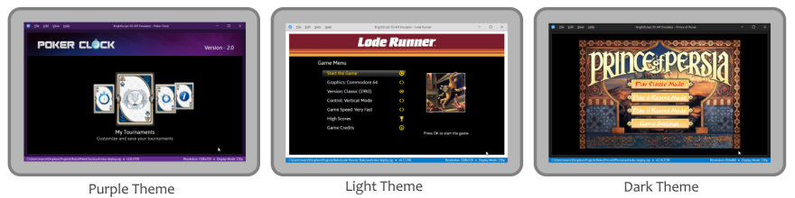

# How to Use the Application

## Menu Options
This section will describe the options available on the application menu, please notice that in **macOS** the options will be possibly in different location, as the OS has different standards than **Windows** and **Linux**.

<p align="center">

</p>

### File Menu

- Open App Package - Allows the user to select a zip/bpk file to load an app
- Open Source File - Allows the user to select a brs file to run on the emulator
- Open Recent - Display a submenu with the recent opened files
- Save Screenshot - Saves the current app screen image to a png file
- Close App - Closes the current app

### Edit Menu

- Copy Screenshot - Copies the current screen image to the OS clipboard
- Settings - Opens the Settings configuration screen

### Device Menu

- Display Modes - Defines the default UI resolution of the emulated device
    - SD 480p - Emulates a device with resolution of 720x480
    - HD 720p - Emulates a device with resolution of 1280x720
    - FHD 1080p - Emulates a device with resolution of 1920x1080
- TV Overscan Modes - Allows emulation of TV overscan effect
    - Disable - Shows the entire image with no cropping or guide lines
    - Guide Lines - Shows guide lines delimiting a potential hidden area by the TV overscan
    - Enabled - Crops the image to emulate the TV overscan effect
- BrightScript App Localization - Submenu with all languages available for app localization
- Web Application Installer - See [documentation](remote-access.md#web-application-installer)
- External Control Protocol - See [documentation](remote-access.md#brightscript-remote-console)
- BrightScript Remote Console - See [documentation](remote-access.md#brightscript-remote-console)
- Reset Device - Resets the emulator releasing any app from the memory, also reloading Dev Tools

### View Menu

- Full Screen - Enter full screen mode. If you double click the screen it also toggles full screen mode
- Color Themes - Allows to select among the 3 available themes</br>

- Always on Top - Toggles if the application will stay on top of other windows when it loses focus
- Status Bar - Toggles if the status bar is displayed

### Help Menu

- Documentation - Opens project [README file](../README.md)
- Control Keyboard Reference - Opens the [remote control keyboard reference documentation](control-reference.md)
- Release Notes - Opens the [release page](https://github.com/lvcabral/brs-emu-app/releases)
- View License - Shows the [application license](../LICENSE)
- About - Shows the about dialog box

## Command Line Options

Here are **optional** arguments you can use when starting the emulator at the command line:

```
"BrightScript Simulator" [-o <path>] [-f] [-m <dm>] [-e] [-t] [-w [<port>]] [-p <newpwd>] [-d]

"BrightScript Simulator" [<path>] [--fullscreen] [--mode=<dm>] [--ecp] [--rc] 
                        [--web[=<port>]] [--pwd=<newpwd>] [--devtools]
```

|Argument                                |Description                                                                  |
|----------------------------------------|-----------------------------------------------------------------------------|
|**-o** `<path>` or `<path>`             | Opens  a `.zip` or `.brs` when starting the emulator.                       |
|**-f** or **--fullscreen**              | Opens the emulator in **full screen mode** (double-click screen to switch). |
|**-m** `<dm>` or **--mode=**`<dm>`      | Changes the **display mode**. Options are: `sd`, `hd`, or `fhd`.            |
|**-e** or **--ecp**                     | Enables [ECP and SSDP servers](https://developer.roku.com/en-ca/docs/developer-program/debugging/external-control-api.md) to allow remote control and detection.|
|**-r** or **--rc**                      | Enables a telnet server on port 8085 to allow **Remote Console** monitoring.|
|**-w** `[<port>]` or **--web**`[=<port>]`| Enables **Web Installer** on port 80 optionally set and save a custom `<port>`.|
|**-p** `<newpwd>` or **--pwd=**`<newpwd>`| Changes the **Web Installer** password and saves it on local storage.      |
|**-d** or **--devtools**                | Opens the **developer tools** when starting the emulator.                   |
