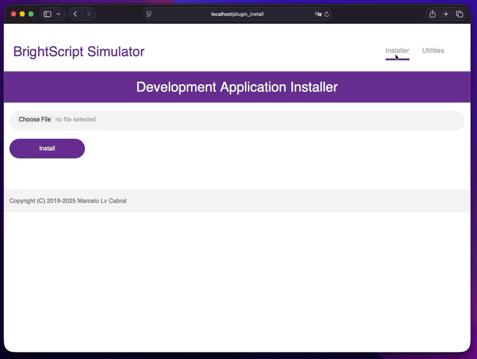

# Remote Access Services

The **BrightScript Simulator** desktop app, the same way all Roku devices, implements some remote access services in order to enable automation and monitoring of the apps being executed. It allows among other possibilities, to integrate the simulator to the [VSCode BrightScript Extension](https://marketplace.visualstudio.com/items?itemName=celsoaf.brightscript) (see [how to integrate to VSCode](vscode-integration.md)). Below you will find a quick reference documentation about the services available.

## Restricting Access to This Machine

By default all the services below accept connections from any device on the local network, the same way a Roku device does. If you prefer to keep the simulator reachable only from the computer it is running on, uncheck **Allow connections from other devices on the network** at the top of the **Remote Access Services** section of the [Settings Screen](how-to-use.md#settings-screen).

When that option is disabled:

- The **Application Installer**, **ECP**, **Remote Console**, **Debug Server** and **Remote Screen** only accept connections coming from `localhost` (`127.0.0.1` or `::1`). Requests from any other address are refused.
- **SSDP** discovery advertisements are suppressed, so the simulator does not show up as a Roku device for the other machines scanning the network.

The change is applied immediately to the services that are already running, and any connection already open from another machine is dropped. Because **SSDP** is turned off, the [VSCode BrightScript Extension](vscode-integration.md) will no longer discover the simulator automatically while this option is disabled — connecting to `127.0.0.1` still works.

## Application Installer

This service allows you to remotely _side load_ an app in the simulator, it has a web interface that can be accessed using a browser, or any _HTTP_ client application. It also has a `Utilities` option where the user can request a screenshot of the currently running app.

[](./images/installer-screenshot.gif)

The **Development Application Installer**  by default listens to the _TCP_ port 80 and requires authentication to be used. Because this port is the default _HTTP_ port, it may cause conflict with existing services or be blocked by IT security policies. To overcome that, is possible to configure a different port, either using the [Settings Screen](docs/how-to-use.md#settings-screen) or running the simulator with the command line `--web=<newport>`, this option is saved in the app local storage. An icon is shown in the status bar with the listening port number indicating the service is active, if the icon is clicked it will open the Installer page on the default browser (image above).

The **Installer** default user and password are both `rokudev`, besides the [Settings Screen](docs/how-to-use.md#settings-screen), the password can also be changed (and saved) by using the command line `--pwd=<newpwd>`.

> [!IMPORTANT]
>
> On Linux systems, due to OS restrictions, the Installer service can not be started on port 80, so the service is disabled by default.
> To enable it, you must specify a different port.

## ECP (External Control Protocol)

Once it's enabled the **ECP API** allows the simulator to be controlled over the network by providing a number of external control commands. When the **ECP** is enabled it is discoverable using **SSDP** (Simple Service Discovery Protocol) just like a Roku device. **ECP** is a simple _RESTful API_ that can be accessed by programs in virtually any programming environment. Please check the [ECP official documentation](https://developer.roku.com/docs/developer-program/dev-tools/external-control-api.md) for detailed documentation of the protocol.

The **ECP** listens to the _TCP_ port 8060 and is disabled by default, it can be enabled either by using the options under the [Device Menu](how-to-use.md#device-menu) or via the [command line option](how-to-use.md#command-line-options) `--ecp`. An icon on the status bar with the port number indicates that the service is active, if the icon is clicked it shows the XML result of the `query/device-info` command on the default browser.

### Supported Commands

The **BrightScript Simulator** desktop app only implements a subset of **ECP** commands, here a list of supported commands:

| Command               | Description                                                                                                       |
|-----------------------|-------------------------------------------------------------------------------------------------------------------|
| query/device-info     | Retrieves device information similar to that returned by roDeviceInfo. (HTTP GET) |
| query/apps            | Returns a map of all the recent opened apps paired with their application ID. (HTTP GET) |
| query/active-app      | Returns a child element named 'app' with the active application, in the same format as 'query/apps'. (HTTP GET) |
| query/icon/`appID`    | Returns an icon corresponding to the application identified by appID. (HTTP GET) |
| query/registry/`appID`| Lists the entries in the device registry for apps. (HTTP GET) |
| query/input           | Sends custom events to the current application. It takes a user defined list of name-value pairs sent as query string URI parameters. (HTTP POST) |
| launch/`appID`        | Launches the app identified by appID. (HTTP POST) |
| exit-app/`appID`      | Terminates the app identified by appID if running. (HTTP POST) |
| keypress/`key`        | Equivalent to pressing down and releasing the remote control key identified after the slash. (HTTP POST) |
| keydown/`key`         | Equivalent to pressing the remote control key identified after the slash. (HTTP POST) |
| keyup/`key`           | Equivalent to releasing the remote control key identified after the slash. (HTTP POST) |

**Note:** The Application ID in the simulator is a simple hash of the full path of the app zip/bpk file.

## BrightScript Remote Console

The **Remote Console** can be accessed using telnet through a shell application such as [PuTTY](http://www.putty.org/) for Windows or terminal on Mac and Linux:

```console
telnet <simulator-ip-address> 8085
```

The simulator now supports the interactive debugging using the **Remote Console**, the list below has the Roku MicroDebugger commands currently implemented:

- `bt` - Print backtrace of call function context frames
- `cont|c` - Continue script execution
- `down|d` - Move down the function context chain one
- `exit|q` - Exit shell
- `gc` - Run garbage collector"
- `last|l` - Show last line that executed
- `next|n` - Show the next line to execute
- `list` - List current function
- `step|s|t` - Step one program statement
- `thread|th` - Show selected thread
- `threads|ths` - List all threads of execution
- `over|v` - Step over one program statement (for now act as step)
- `out|o` - Step out from current function (for now act as step)
- `var` - Display local variables and their types/values
- `print|p|?` - Print variable value or expression
- `exit` or `quit` - Finishes current app execution
- `close` - Disconnect from the remote console
- `help` - Show a list of supported commands

When the debugger is activated (either with `STOP` statement or via `Ctrl+Break`) you can type any expression for a live compile and run, in the context of the current function.

If the **Remote Console** is enabled an icon is shown in the status bar together with the port number 8085.

## Remote Screen

The **Remote Screen** service streams the simulator display to a browser on your network over **WebRTC**, so you can watch and control a running app from a phone, a tablet or another computer. This has no Roku counterpart — a real device has no equivalent feature — so it is specific to the simulator.

It listens to the _TCP_ port 8090 and is **disabled by default**. Enable it from the [Device Menu](how-to-use.md#device-menu) or the **Remote Access Services** section of the [Settings Screen](how-to-use.md#settings-screen), then open `http://<simulator-ip-address>:8090/` in any modern browser. An icon with the port number appears in the status bar while the service is running; clicking it opens the viewer page locally. If the [Application Installer](#application-installer) is also enabled, its **Utilities** tab shows a **Video Stream** button that opens the viewer — useful when you already have the installer open on another device.

The viewer page provides:

- **Live video** of the simulator screen.
- **An on-screen Roku remote**, plus the equivalent physical keyboard keys (arrows, `Enter`, `Escape`, `Backspace`, `End` and `Home`).
- **A text field** for typing into on-screen keyboards, which is often easier than pressing letters one at a time.
- **A screenshot button** that downloads the current frame as a PNG.
- **The page's own address**, shown under the video with a button that copies it, so it is easy to pass to another device.

> [!WARNING]
>
> **This service has no password.** Unlike the **Application Installer**, anyone who can reach port 8090 can watch your simulator screen, and — if **ECP** is also enabled — control it. That is why it is the only service disabled by default. If you enable it, either keep **Allow connections from other devices on the network** unchecked, or only enable it on networks you trust.

A few things worth knowing:

- **The remote buttons need [ECP](#ecp-external-control-protocol) enabled**, because that is what they are sent through. The viewer page detects this and shows a banner if **ECP** is off. Text entry and the screenshot button work either way.
- **Video only, no audio.** Audio is not part of the stream.
- **Up to four viewers at a time.** Each one is a separate video encode, so the cap protects the simulator's frame rate. A fifth viewer is told the simulator is busy.
- **LAN only.** No STUN or TURN server is used, so the browser and the simulator have to be able to reach each other directly. This does not work across the internet.
- **Only the viewer page itself can use the service.** The video channel and the text field refuse requests that come from a page on any other website, so browsing elsewhere while the service is running cannot expose your screen — but that protection stops at the browser, so the warning above still applies to anything else on the network.
- **The stream is always at the display mode's full resolution** (720x540 for 480p, 1280x720 for 720p, 1920x1080 for 1080p), regardless of the simulator window size, so shrinking the window or going fullscreen neither disturbs nor degrades it. Changing the display mode briefly interrupts the stream while it renegotiates.
- **Updates are sent as the app draws them**, so the stream stays in step with the simulator whether the app is animating constantly or sitting on a static menu.
- While at least one viewer is connected, the simulator window keeps rendering even if it is minimized. Without that, minimizing would freeze the stream on a stale frame.
